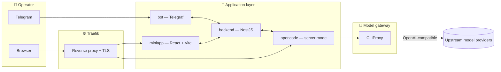
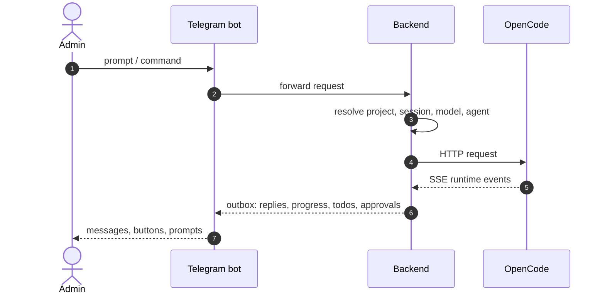

<div align="center">


# Remote Vibe Station

**A Docker-based remote development workspace built around OpenCode, Telegram, and a browser-accessible control surface.**

*Deploy the stack on a remote host. Code from your phone. Open the dashboard when you need a bigger screen.*

[](#license)
[](#architecture)
[](#deployment)
[](#runtime-requirements)

[**Quick start**](#-quick-start) ·
[**Architecture**](#-architecture) ·
[**Mini App**](#-mini-app) ·
[**Deployment**](#-deployment) ·
[**Local dev**](#-local-development)

</div>

---

## Why this project exists

Remote Vibe Station is a server-first AI coding workspace. Instead of running OpenCode on your laptop, you put it on a Linux host you actually trust with `Docker access`, `/hostfs`, and host-level operations — then drive it from anywhere.

- **Telegram-first control plane** — prompts, slash commands, approvals, runtime notices, voice messages.
- **Mini App for visual ops** — projects, files, Git, containers, providers, runtime updates.
- **Browser access on demand** — magic-link gated entry to OpenCode Web UI through Traefik forward-auth.
- **Pluggable model gateway** — CLIProxy fronts multiple provider accounts behind a single OpenAI-compatible surface.
- **Image-only runtime** — published Docker images deploy straight to a clean Ubuntu host. No source checkout on the server.

> [!TIP]
> The bootstrap installer takes a fresh Ubuntu/Debian box and brings up the entire stack with TLS, firewall hardening, and Docker log rotation in one command.

---

## Highlights

| Capability | What you get |
| --- | --- |
| **Telegram workflow** | Prompts, slash commands, progress streams, approval prompts, runtime notices, voice transcription via Groq. |
| **Mini App** | Project switcher, file browser, terminal, Git ops, container controls, provider settings, runtime updates. |
| **Secure web access** | Time-limited browser links to OpenCode Web UI, gated by Traefik forward-auth. |
| **Multi-provider models** | CLIProxy aggregates upstream accounts and exposes a single `/v1/models` catalog to OpenCode. |
| **Image-based ops** | One-shot bootstrap → versioned releases → in-app `Update runtime` with `Rollback` to last `.env` snapshot. |
| **VLESS-aware** | Optional outbound proxy mode, configured from Mini App and applied to selected services without redeploys. |

---

## ⚡ Quick start

> [!IMPORTANT]
> Use a clean Ubuntu/Debian-compatible host. The installer performs host-level setup (Docker, UFW, fail2ban, systemd timers) and is designed for a dedicated remote runtime, not a shared workstation.

**One-line install with auto-domain (`sslip.io`-based):**

```bash
curl -fsSL https://raw.githubusercontent.com/nyxandro/remote-vibe-station/master/scripts/bootstrap-runtime.sh | sudo bash -s -- \
  --bot-token "<TELEGRAM_BOT_TOKEN>" \
  --admin-id "<TELEGRAM_ADMIN_ID>" \
  --domain auto \
  --tls-email "<YOUR_EMAIL>"
```

**Custom domain:**

```bash
curl -fsSL https://raw.githubusercontent.com/nyxandro/remote-vibe-station/master/scripts/bootstrap-runtime.sh | sudo bash -s -- \
  --bot-token "<TELEGRAM_BOT_TOKEN>" \
  --admin-id "<TELEGRAM_ADMIN_ID>" \
  --domain "example.com" \
  --tls-email "ops@example.com"
```

When `--domain auto` is used, the installer resolves the public IPv4 and produces:

```text
<ip>.sslip.io           # Mini App + backend
code.<ip>.sslip.io      # OpenCode Web UI
```

After the installer finishes, open Telegram, send a prompt to your bot, or `/start` and follow the menu.

---

## 🏗 Architecture

The runtime is split into a small number of focused services orchestrated by Docker Compose and fronted by Traefik:



| Service | Purpose |
| --- | --- |
| `services/bot` | Telegram bot (Telegraf). Accepts admin commands, forwards prompts, polls the backend outbox, grants browser access. |
| `services/backend` | NestJS orchestration layer. Owns projects, prompts, sessions, runtime events, file APIs, provider management. |
| `services/miniapp` | React + Vite Telegram Mini App for visual workspace management. |
| `services/opencode` | OpenCode runtime in server mode, exposed behind Traefik and configured dynamically at startup. |
| `cliproxy` | OpenAI-compatible model gateway used by OpenCode for provider/model access. |
| `proxy` | Traefik reverse proxy: TLS, host/path routing, OpenCode forward-auth middleware. |

### Telegram prompt flow



### Model and mode flow

- OpenCode discovers available models dynamically from `cliproxy /v1/models` at container startup.
- Telegram-selected mode is persisted in backend preferences.
- Backend overrides OpenCode prompt model/agent explicitly per request.
- OpenCode config defaults are kept in sync, so a fresh Web UI session starts in the same execution mode.

---

## 📲 Mini App

The Mini App is the richer surface for tasks that are awkward in chat. The whole UI follows one design language: pill buttons, card-style sections, accent-soft primaries, and a unified token system in light and dark themes.

| Surface | Highlights |
| --- | --- |
| **Projects** | Searchable card grid, active-project badge, Git stats and container health pills, sticky toolbar. |
| **Files** | Card-framed list, monospace path strip, native upload modal with drop-zone, fullscreen preview. |
| **Terminal** | IDE-styled output card, pill input with monospace font, accent-soft send button. |
| **Git** | Branch card with ahead/behind pill, switch/merge/commit cards, file-list with status chips. |
| **Containers** | Compose controls, per-container card with start/restart/stop pill icon-buttons, terminal-styled logs. |
| **Providers** | Connected-provider cards with status badges, picker grid with internal scroll, CLIProxy runtime panel. |
| **Skills** | NeuralDeep catalog with search/filter, one-click install with live progress, paginated load-more. |
| **Kanban** | Column board with drag-and-drop, segmented status/priority controls, mobile bottom-sheet editor. |
| **Settings** | Accordion sections, runtime dashboard, runtime updater, server metrics, theme toggle, voice-control. |

> [!NOTE]
> Modals on mobile turn into bottom sheets with a drag-handle indicator, sticky CTA footer, and `env(safe-area-inset-bottom)` so primary actions stay above the home indicator.

---

## 🚀 Deployment

This repository is designed around image-based deployment.

### CI/CD pipeline

- Pushes to `master` trigger image builds and publication to GHCR.
- Stable runtime updates are discovered from GitHub Releases (e.g. `v0.2.1`).
- The Mini App checks the latest release and offers **Update runtime** when a newer release exists.
- Updates save the previous `.env` as `.env.previous`, pull new images, and restart the stack.
- **Rollback** restores the previous `.env` snapshot and reapplies Compose.

Relevant workflows:

- `.github/workflows/build-images.yml`
- `.github/workflows/deploy-runtime.yml`

`Deploy Runtime` is kept as a manual emergency workflow. The normal production path is image build + Mini App runtime update.

### Runtime update flow in Mini App

1. Open Mini App.
2. Go to **Settings → Runtime updates**.
3. Press **Check**.
4. If a newer release exists, press **Update runtime**.
5. During restart the Mini App may briefly disconnect; it reconnects and shows persisted state.
6. If the new release is broken, press **Rollback** to return to the previous runtime snapshot.

> [!TIP]
> `Check` compares the current runtime version to the latest GitHub Release. It does not treat every `master` commit as a production update.

<details>
<summary><b>Manual emergency rollout</b> — when CI/CD is temporarily unavailable</summary>

```bash
cd /opt/remote-vibe-station-runtime
docker compose --env-file .env -f docker-compose.yml -f docker-compose.vless.yml pull
docker compose --env-file .env -f docker-compose.yml -f docker-compose.vless.yml up -d --remove-orphans
```

</details>

<details>
<summary><b>VLESS / outbound proxy runtime</b></summary>

Fresh installs keep VLESS disabled. The installer writes a no-op `docker-compose.vless.yml` and empty proxy placeholders so the runtime never starts with fake credentials.

To enable:

1. Open Mini App.
2. Go to **Providers → CLIProxy runtime**.
3. Switch to `vless` mode.
4. Paste the real `vless://...` config URL.
5. Test, then save settings.
6. Press **Apply runtime now**.

The backend rewrites VLESS files and restarts the selected services with proxy routing.

</details>

<details>
<summary><b>Verification after install or update</b></summary>

```bash
cd /opt/remote-vibe-station-runtime
docker compose --env-file .env -f docker-compose.yml -f docker-compose.vless.yml ps
docker compose --env-file .env -f docker-compose.yml -f docker-compose.vless.yml logs --tail=100 \
  backend bot miniapp opencode cliproxy proxy
```

Expected URLs:

```text
https://<domain>/miniapp
https://<opencode-domain>
```

</details>

<details>
<summary><b>Stop or remove the runtime</b></summary>

Stop the runtime without deleting data:

```bash
cd /opt/remote-vibe-station-runtime
docker compose --env-file .env -f docker-compose.yml -f docker-compose.vless.yml stop
```

Remove containers without deleting named volumes:

```bash
cd /opt/remote-vibe-station-runtime
docker compose --env-file .env -f docker-compose.yml -f docker-compose.vless.yml down
```

</details>

---

## 🔧 What the installer does

The bootstrap script downloads only the runtime install assets and runs `scripts/install-runtime.sh`.

| Step | Action |
| --- | --- |
| **Host packages** | Installs `ca-certificates`, `curl`, `git`, `iproute2`, `jq`, `openssl`, `ufw`, `fail2ban`. |
| **Docker** | Installs Docker if not already present. |
| **Runtime tree** | Creates `/opt/remote-vibe-station-runtime`, projects root `/srv/projects`. |
| **Secrets** | Generates runtime secrets and writes `.env`. |
| **Compose & infra** | Writes `docker-compose.yml`, `docker-compose.vless.yml`, Traefik config, CLIProxy config, VLESS placeholders. |
| **Logging** | Configures Docker log rotation. |
| **SSH** | Hardens SSH to key-only mode when authorized keys already exist. |
| **Firewall** | Opens `22`, `80`, `443` in UFW; enables `fail2ban` for SSH. |
| **Maintenance** | Installs a systemd timer for Docker cleanup. |
| **Bring-up** | Runs preflight checks, pulls images, starts the stack. |

> [!IMPORTANT]
> The installer never copies project source code into the runtime directory. Services run from published Docker images. Source-controlled code remains in this Git repository, and CI/CD publishes runtime images.

### Runtime tree

```text
/opt/remote-vibe-station-runtime/
├── .env
├── docker-compose.yml
├── docker-compose.vless.yml
├── runtime-maintenance.sh
└── infra/
    ├── cliproxy/config.yaml
    ├── traefik/traefik.yml
    ├── traefik/acme.json
    ├── traefik/dynamic/noindex.yml
    ├── traefik/dynamic/opencode-auth.yml
    └── vless/
        ├── proxy.env
        └── xray.json
```

---

## ⚙️ Runtime requirements

- Linux host with Docker support.
- Telegram bot token.
- One or more Telegram admin IDs.
- A public domain, or `auto` for `sslip.io`-based setup.
- An email address for Let's Encrypt.
- Network access for pulling GHCR images and reaching model/provider endpoints.

<details>
<summary><b>Runtime variables written by the installer</b></summary>

```text
COMPOSE_PROJECT_NAME=remote-vibe-station
TELEGRAM_BOT_TOKEN=<provided>
ADMIN_IDS=<provided>
PUBLIC_BASE_URL=https://<domain>
PUBLIC_DOMAIN=<domain>
OPENCODE_PUBLIC_BASE_URL=https://<opencode-domain>
OPENCODE_PUBLIC_DOMAIN=<opencode-domain>
PROJECTS_ROOT=/srv/projects
RVS_RUNTIME_VERSION=<display-version>
RVS_RUNTIME_IMAGE_TAG=<image-tag>
RVS_RUNTIME_COMMIT_SHA=<source-commit-sha>
BOT_BACKEND_AUTH_TOKEN=<generated>
OPENCODE_SERVER_PASSWORD=<generated>
CLIPROXY_API_KEY=<generated>
CLIPROXY_MANAGEMENT_PASSWORD=<generated>
RVS_BACKEND_IMAGE=<image>
RVS_MINIAPP_IMAGE=<image>
RVS_BOT_IMAGE=<image>
RVS_OPENCODE_IMAGE=<image>
RVS_CLIPROXY_IMAGE=<image>
```

`RVS_RUNTIME_VERSION` is the human-readable release shown in the UI.
`RVS_RUNTIME_IMAGE_TAG` is the actual Docker image tag used for deploys (`v0.2.1`, `sha-<commit>`, …).

</details>

---

## 🧱 Repository layout

```text
.
├── services/
│   ├── backend/    # NestJS orchestration, project/git/file/runtime APIs
│   ├── bot/        # Telegraf bot, outbox poller, callback handlers
│   ├── miniapp/    # React + Vite mini-app
│   └── opencode/   # OpenCode runtime image with provider sync entrypoint
├── infra/          # Traefik, CLIProxy, VLESS placeholders
├── scripts/        # Bootstrap, install-runtime, preflight, templates
├── ops/            # Operational helpers
├── templates/      # Runtime templates rendered by the installer
├── docker-compose.yml
└── README.md
```

### Backend areas

- `services/backend/src/projects/` — project lifecycle, files, Git, terminal.
- `services/backend/src/prompt/` — prompt orchestration into OpenCode.
- `services/backend/src/open-code/` — OpenCode HTTP/SSE integration.
- `services/backend/src/telegram/` — Telegram APIs, preferences, outbox bridge, provider settings.
- `services/backend/src/proxy/` — CLIProxy account and mode management.
- `services/backend/src/system/` — runtime services and operational endpoints.

---

## 💻 Local development

Each service is developed independently.

<details open>
<summary><b>Backend</b></summary>

```bash
cd services/backend
npm install
npm run start:dev
```

</details>

<details>
<summary><b>Bot</b></summary>

```bash
cd services/bot
npm install
npm run start:dev
```

</details>

<details>
<summary><b>Mini App</b></summary>

```bash
cd services/miniapp
npm install
npm run dev
```

</details>

### Testing

```bash
cd services/backend && npm test && npm run typecheck
cd services/bot     && npm test && npm run typecheck
cd services/miniapp && npm test
```

The backend and bot contain focused tests for Telegram bridging, runtime orchestration, session control, and provider flows.

---

## 🗺 Supported user workflows

- Chat with OpenCode from Telegram.
- Switch projects and sessions remotely.
- Open OpenCode Web UI securely from Telegram.
- Review tool progress, file updates, todos, and permission prompts in chat.
- Configure model/provider/agent preferences.
- Connect provider accounts and CLIProxy-backed model sources.
- Manage project files, Git, and terminal access from the Mini App.
- Operate voice-control flows for Telegram voice messages.

---

## 🛠 Scripts and infrastructure

| Asset | Purpose |
| --- | --- |
| `scripts/bootstrap-runtime.sh` | One-command bootstrap installer. |
| `scripts/install-runtime.sh` | Main runtime installation script. |
| `scripts/install-runtime-preflight.sh` | Host validation / preflight checks. |
| `scripts/templates/runtime-docker-compose.yml` | Runtime Compose template. |
| `infra/traefik/traefik.yml` | Traefik base configuration. |
| `infra/traefik/dynamic/opencode-auth.yml` | OpenCode forward-auth middleware. |
| `infra/cliproxy/config.yaml` | CLIProxy configuration. |

---

## 📋 Operational notes

> [!WARNING]
> Treat merges into `master` as deployment triggers. Production Docker images are built only from the canonical CI pipeline on `master`. Manual or local builds on the server from outdated sources are forbidden — they desynchronise code from configuration.

- Prefer Docker Compose `stop`/`start` for dev/runtime operations when data persistence matters.
- Run database/runtime migrations inside the appropriate containers.
- Do not rely on local manual server builds from stale source trees; use published images from CI whenever possible.

---

## 📜 License

MIT

<div align="center">

—

<sub>Remote Vibe Station · server-first AI coding workspace · made for operators who like calm tools.</sub>

</div>
